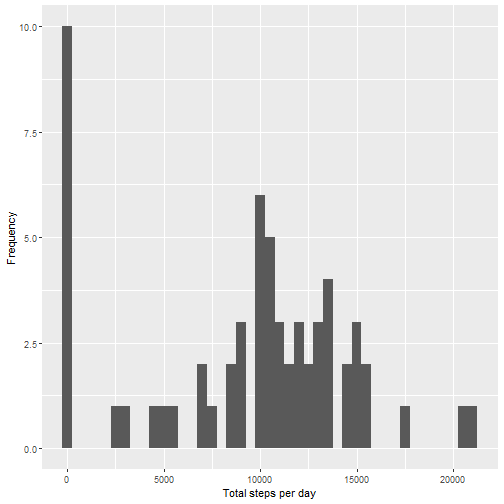
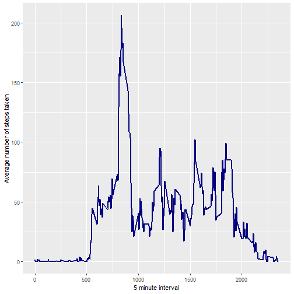
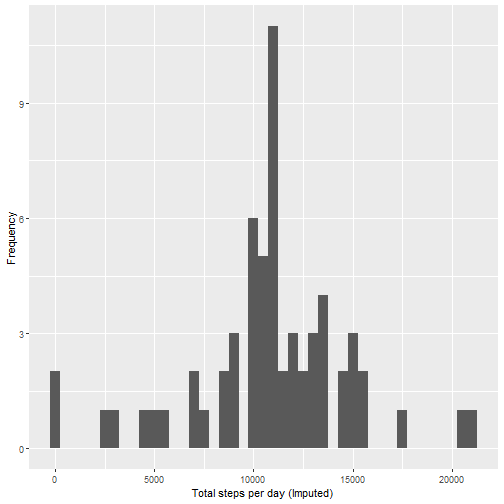
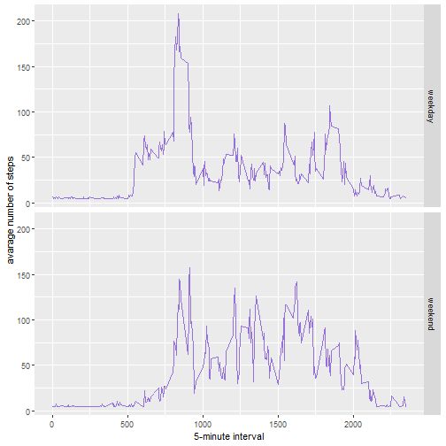

# Reproducible Research: Peer Assessment 1

## Loading necessary libraries


## Loading and preprocessing the data

##### 1. Load the data (i.e. read.csv())


```r
activity <- read.csv('activity.csv')
```

##### 2. Process/transform the data (if necessary) into a format suitable for your analysis


```r
#activityData$interval <- strptime(gsub("([0-9]{1,2})([0-9]{2})", "\\1:\\2", activityData$interval), format='%H:%M')
```

## What is mean total number of steps taken per day?


```r
totalsteps <- tapply(activity$steps, activity$date, sum, na.rm=TRUE)
```

##### 1. Make a histogram of the total number of steps taken each day


```r
qplot(totalsteps, xlab='Total steps per day', ylab='Frequency', binwidth=500)
```



##### 2. Calculate and report the mean and median total number of steps taken per day


```r
Meanval <- mean(totalsteps)
Medianval <- median(totalsteps)
```

Mean Value: 9354.2295082  
Median Value:  10395


## What is the average daily activity pattern?


```r
avg <- aggregate(x=list(meanSteps=activity$steps), by=list(interval=activity$interval), FUN=mean, na.rm=TRUE)
```

##### 1. Make a time series plot


```r
ggplot(data=avg, aes(x=interval, y=meanSteps)) +
    geom_line(color = "navyblue", size =1) +
    xlab("5 minute interval") +
    ylab("Average number of steps taken") 
```



##### 2. Which 5-minute interval, on average across all the days in the dataset, contains the maximum number of steps?


```r
mostSteps <- which.max(avg$meanSteps)
timeMostSteps <-  gsub("([0-9]{1,2})([0-9]{2})", "\\1:\\2", avg[mostSteps,'interval'])
```

Most Steps at: 8:35


## Imputing missing values

##### 1. Calculate and report the total number of missing values in the dataset 


```r
MissingValues <- length(which(is.na(activity$steps)))
```

Number of missing values: 2304

##### 2. Devise a strategy for filling in all of the missing values in the dataset.

We'll fill in the missing values with the `steps` mean

##### 3. Create a new dataset that is equal to the original dataset but with the missing data filled in.


```r
activityImputed <- activity
activityImputed$steps <- impute(activity$steps, fun=mean)
```


##### 4. Make a histogram of the total number of steps taken each day 


```r
totalsteps_Imputed <- tapply(activityImputed$steps, activityImputed$date, sum)
qplot(totalsteps_Imputed, xlab='Total steps per day (Imputed)', ylab='Frequency', binwidth=500)
```



##### Calculate and report the mean and median total number of steps taken per day. 


```r
TotalStepsImputed_mean <- mean(totalsteps_Imputed)
TotalStepsImputed_median <- median(totalsteps_Imputed)
```
Mean (Imputed): 1.0766189 &times; 10<sup>4</sup>  
Median (Imputed):  1.0766189 &times; 10<sup>4</sup>


## Are there differences in activity patterns between weekdays and weekends?

##### 1. Create a new factor variable in the dataset with two levels – “weekday” and “weekend” indicating whether a given date is a weekday or weekend day.


```r
activityImputed$dateType <-  ifelse(as.POSIXlt(activityImputed$date)$wday %in% c(0,6), 'weekend', 'weekday')
```

##### 2. Make a panel plot containing a time series plot


```r
avgImputed <- aggregate(steps ~ interval + dateType, data=activityImputed, mean)
ggplot(avgImputed, aes(interval, steps)) +
  geom_line(color = "mediumpurple") +
  facet_grid(dateType ~ .) +
  xlab("5-minute interval") +
  ylab("avarage number of steps")
```


